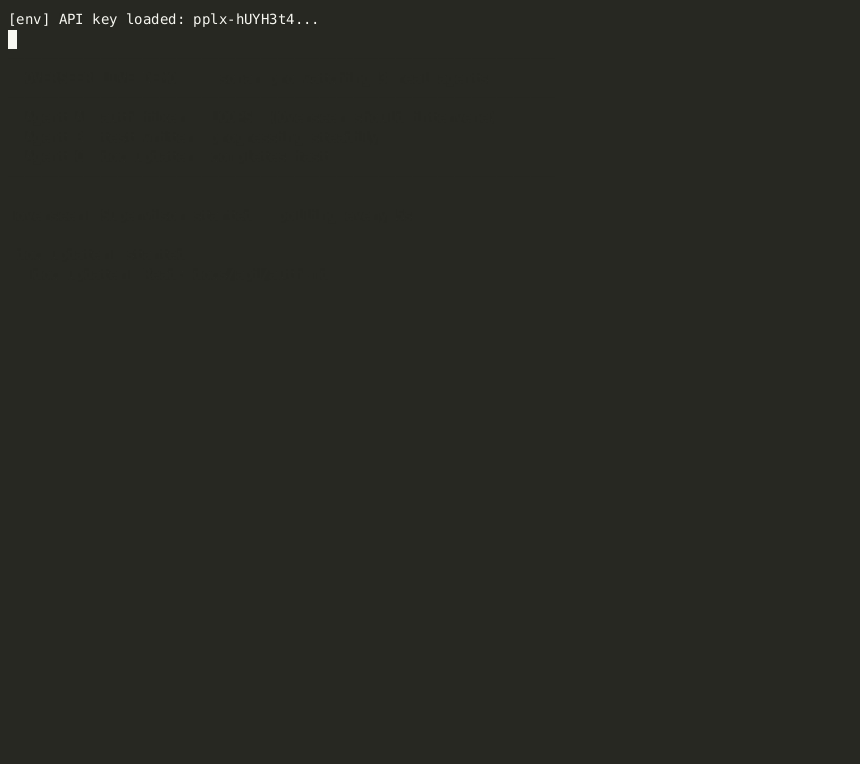

# Overseer

**A supervisor agent that watches your AI agents and stops them before they waste your money.**

Overseer runs alongside your agent pipeline. Every few seconds it reads each agent's action history, calls the **Perplexity `sonar-pro`** model to analyze for wasteful patterns, and intervenes — injecting context, restarting the agent, or escalating to a human — before the loop burns thousands of tokens.



> sonar-pro detecting a loop at **92% confidence** and injecting a corrective message. The model estimated ~6,500 tokens of waste avoided
(an estimate, not a measurement — see Limitations).

**[→ Live dashboard](https://navinagrawalchung07.github.io/Overseer/)** — the dashboard UI, running in demo mode.
The supervisor itself is a local process, so the hosted page replays a scripted
agent run rather than driving a live backend. To see the real detection loop,
run it locally (below).

---

## The Problem

Multi-agent systems break in three predictable ways:

| Pattern | What it looks like | Cost |
|---|---|---|
| **Looping** | Agent reads the same file 5× with no edits | ~6,000 tokens |
| **Drifting** | Agent wanders off-task entirely | Entire budget |
| **Stalling** | Agent stops taking meaningful actions | Time + money |

Existing observability tools (LangSmith, Langfuse) **watch**. Overseer **acts**.

---

## Install

```bash
pip install overseer-ai
export PERPLEXITY_API_KEY=pplx-...
```

---

## Usage

### Level 1 — Zero code changes

Point Overseer at any directory where your agent writes logs.

```bash
overseer watch --agents ./my-agent-logs/
```

### Level 2 — SDK decorator (custom agents)

Wrap your agent function with `@tracked`. Two lines added, full supervision enabled.

```python
from overseer.adapters.sdk import tracked, log_action

@tracked(agent_id="auth-fixer", task="Fix the token expiry bug in src/auth/")
def run():
    while True:
        log_action("auth-fixer", "Read", "src/auth/token.ts", tokens=1240)

        iv = run.check_intervention()
        if iv:
            if iv["type"] == "inject_context":
                context = iv["message"]
                # pass context to your next LLM call
            elif iv["type"] == "stop_and_restart":
                new_prompt = iv["revised_prompt"]
                break

run()
```

### Level 2 — CrewAI native integration

Replace `Crew(...)` with `overseer_crew(...)`. That is the only change.

```python
from overseer.adapters.crewai_adapter import overseer_crew
from crewai import Agent, Task, Process

researcher = Agent(role="Investigator", goal="...", tools=[...])
engineer   = Agent(role="Engineer",     goal="...", tools=[...])

research_task = Task(description="...", agent=researcher)
fix_task      = Task(description="...", agent=engineer, context=[research_task])

def on_intervention(iv):
    print(f"Overseer intervened: {iv['message']}")

crew = overseer_crew(
    agent_id="bug-fixer-crew",
    task="Fix token expiry bug in src/auth/",
    on_intervention=on_intervention,

    # Everything below is standard crewai.Crew() kwargs — unchanged
    agents=[researcher, engineer],
    tasks=[research_task, fix_task],
    process=Process.sequential,
    verbose=True,
)
crew.kickoff()
```

See [`examples/crewai/bug_fixer_crew.py`](examples/crewai/bug_fixer_crew.py) for a full working two-agent example.

---

## CLI

```bash
overseer watch       # start supervisor (terminal output)
overseer dashboard   # launch web dashboard at http://localhost:7860
overseer status      # show all agent statuses
overseer history     # show recent interventions
```

---

## Run the demo

```bash
git clone https://github.com/navinagrawalchung07/Overseer
cd overseer
pip install -e .
cp .env.example .env  # add your PERPLEXITY_API_KEY

# Terminal 1 — start the supervisor
overseer watch

# Terminal 2 — run three simulated agents (one will loop)
python demo/agent_runner.py
```

Agent `auth-fixer` will loop — reading the same file repeatedly with no edits. Overseer detects the pattern via sonar-pro, fires an `inject_context` intervention, and the agent recovers.

---

## How It Works

```
Agent action  →  actions.jsonl  →  Supervisor polls every N seconds
     ↓
Perplexity sonar-pro analyzes action window
     ↓
{ status, confidence, pattern, intervention, message, tokens_saved }
     ↓
confidence > 0.78 and status != healthy:
  inject_context   →  write intervention.json (agent reads on next tick)
  stop_and_restart →  kill and relaunch with revised prompt
  escalate         →  webhook / notification for human review
     ↓
Savings logged to ~/.overseer/history.json
```

---

## Adapters

| Adapter | Integration | Effort |
|---|---|---|
| **File watcher** | Point at any log directory | Zero — no code changes |
| **`@tracked` decorator** | Wrap any Python agent function | 2 lines |
| **`overseer_crew()`** | Drop-in for `crewai.Crew()` | 1 line change |
| **Claude Code hook** | PostToolUse hook (via Interception) | 1 install command |
| **LangChain** | Callback handler (coming soon) | Drop-in |

---

## Configuration

| Variable | Default | Description |
|---|---|---|
| `PERPLEXITY_API_KEY` | — | Required |
| `OVERSEER_POLL_INTERVAL` | `10` | Seconds between supervisor ticks |
| `OVERSEER_CONFIDENCE` | `0.78` | Minimum confidence to trigger intervention |
| `OVERSEER_PORT` | `7860` | Dashboard port |

---

## Limitations

Honest accounting of where this prototype stands:

- **"Tokens saved" is an estimate, not a measurement.** The number comes from the
  model's own `tokens_wasted_estimate` field. Measuring it properly needs a
  counterfactual — projecting the loop's observed burn rate, or A/B running the
  same task with the supervisor on and off.
- **No cooldown between interventions.** If an agent doesn't change behavior before
  the next poll, the same window re-classifies and fires again.
- **Detection cost scales with fleet size, not with incidents.** One model call per
  agent per interval regardless of whether anything is wrong. A cheap repeat-detection
  prefilter (`OVERSEER_HEURISTIC_REPEAT`) is configured but not yet wired up.
- **Interventions are advisory.** Even `stop_and_restart` only writes a file; nothing
  is force-killed. An agent that ignores interventions can't be stopped.
- **File writes are not atomic**, and `intervention.json` is a single slot — a second
  intervention overwrites an unconsumed first.
- **No test suite yet.**
- **The hosted dashboard runs in demo mode.** The supervisor is a local process, so
  the GitHub Pages build replays a scripted agent run.

---

## License

MIT
